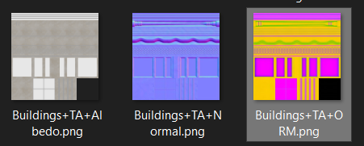

# Texture Trim Tool for Blender > PBR > Unity

**Disclaimer:** This script was initially created to streamline my pipeline for creating trimmed textures in Blender and rendering them for use in Unity. It is offered free for general use; however, please be cautious as it modifies scene render settings.

# Dicumentation is for myself actualy

## Setup

1. **Lunch script via blenders script editor.**
2. **Setup Master Shader Group:** Ad use it insted `Principled BSDF`. Append `Baker.MainShader()` form assets.blend.

3. **Create Layered Scene:** Set up your scene like layered cake: camera. objects, background plane. Append `Baker.BGPlane()` form assets.blend.

## How to Use

Create suches burger:

1. **Enter Main Shader Name:** Provide the name of the main shader in your project. This allows the script to switch connections within the shader and render different passes as required.

2. **Select Camera(s):** Choose the camera or cameras that you want to use for rendering. The script will process each selected camera, rendering and saving the results to the default folder.

3. **Set Camera Name to Texture Atlas  Name:** Ensure that each selected camera has a unique name. The script will append a postfix to each image file, using the camera's name as the base.

4. **Bake:** Execute the script to get this: 

   
